<!--        Censo - Form - README  --version 1.0  -->
<!-- William Samir Peña Ortega  [waamirdev@gmail.com] 7th April, 2023 -->

<h1 align="center" style="font-weight: 500;" id="censo-form-2504209">
    

        
        CENSO - FORM - 2504209
        
    

    
</h1>

    
    
    
    
    
    
    
    
    
    
    

> **We are working hard on Censo - Form v2.0. If you are new to this web Aplication, read this document.**

> Mark this repository with a **Star** :star2:
 

# :pencil: Index

* <a href="#censo-form-2504209">CENSO - FORM - 2504209</a>
* [Introduction](#bulb-introduction)
* [Project Status](#project-status-traffic_light)
* [Usage](#usage-hotsprings)
    * [Recording the Apprentice information](#recording-the-apprentice-information-black_nib)
        * [Empty field](#empty-fields)
        * [Wrong email format](#wrong-email-format)
        * [Missing ID numbers](#missing-id-numbers)
        * [Missing numbers of Mobile phone number](#missing-numbers-of-mobile-phone-number)
    * [Sending the Information](#sending-the-information-rocket) 
        * [Success](#success)
        * [Double Register](#double-register)
        * [Error](#error)
    * [Administrator User Login](#administrator-user-login-exclamation-exclamation)
        * [Wrong User Name or Password](#wrong-user-name-or-password)
        * [Database Error](#database-error)
    * [Administrator User CRUD Page](#administrator-user-crud-page-construction_worker)
        * [Apprentice Section](#apprentice-section)
        * [Read Section](#read-section)
        * [Update Section](#update-section)
        * [Delete Record](#delete-record)
* [Tecnologies](#computer-tecnologies)
    * [For Development](#for-development)
    * [For Versioning](#for-versioning)
* [Contact](#e-mail-contact)

# :bulb: Introduction

Project under development as a result to the need to keep track of the apprentices's personal information.

The Project consists of building a web aplication that allows an apprentice to register their personal information in a form, and allows an administrator user to keep track of the records by performing certain actions such as deleting, updating and reading the information of a specific apprentice.

# Project Status :traffic_light:

:construction: *Project under Construction* :construction:
 
 

# Usage :hotsprings:

This Web Aplication is a project for the apprentices to register the information, so the administrator users can keep track of the records.

- The Web Aplication must have fields for insertion of the information.
- All input fields marked with an asterik (*) must be fill out.
- The input fields where numbers are required must only allow numbers.
- The input fields where letters are required must only allow letters.
- Some input fields will allow the user to insert both numbers and letters.
- The Web Aplication must have a Login Page for the adminitrator users.
- The administrator users must have access to the CRUD Panel.
 
 

## Recording the Apprentice information :black_nib:

By inserting all the information in the rigth input fields the apprentices will be able to send their data to be procesed and stored in the database.

If the apprentice does not enter data correctly, the form will show error messages that will indicate the apprentice which value field must be changed.
 
 

Examples:

### `Empty fields` 
 

When a input marked as required is not filled in this message will be shown.

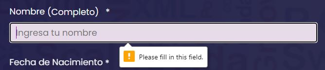

 
 

### `Wrong email format` 
 

When the email input field does not meet the email format requierments (myemail@domain.com) this message will be shown.

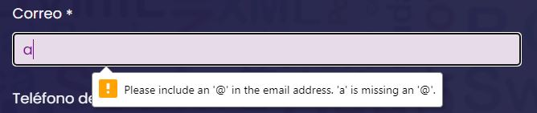

 
 

### `Missing ID numbers` 
 

The least quantity of digits in the ID field is 8, if the ID entered has less digits this message will be shown. 

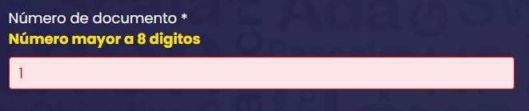

 
 

### `Missing numbers of Mobile phone number` 
 

In the Mobile Phone Number input field can be entered Landline numbers (7 digits) and Mobile Phone Numbers (10 digits), any different quantity of digits will display this message.

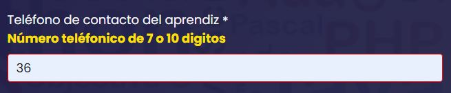

 
 

## Sending the Information :rocket:

After sending the apprentice information, the user will be redirected to a message page that will show the result of the register.
 
 

Here are the possible messages:

### `Success` 
 

This message will appear when the register successfully stored the apprentice data in the database.

 
 

### `Double Register` 
 

This messages will be shown when the apprentice's ID number is already registered in the database and will not alterate the record that's already in the database.

 
 

### `Error` 
 

This messages will be displayed when an error occurs at the moment of the execution of the SQL query.

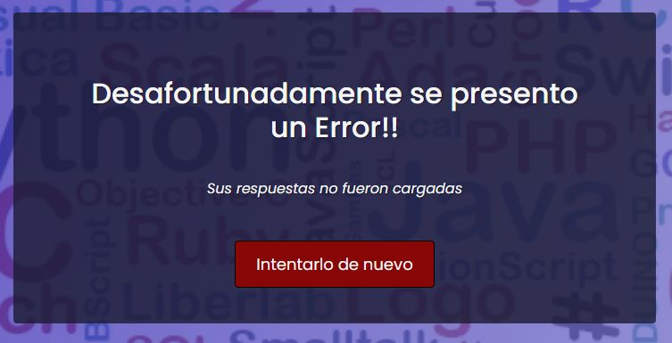

 
 

## Administrator User Login :exclamation: :exclamation:

In this case the aplication will display the Login Page where the Administrator User must enter the required data to log into the CRUD Web Aplication.

- User Name 
- Password
 
 

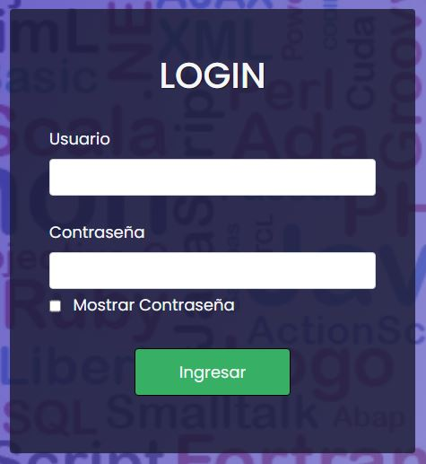

These data are provided by the Owner of this program and can be changed by the same person.

When trying to log into the Administrators section, two errors can occur, which are explained below:
 
 

### `Wrong User Name or Password` 
 

This message will appear when the user name or password entered are different than the ones registered in the database.

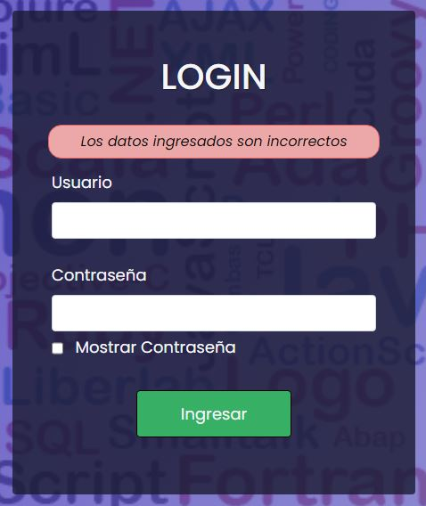

 
 

### `Database Error` 
 

This error will be shown when there's been an error during the execution of the query or during the connection to the database.

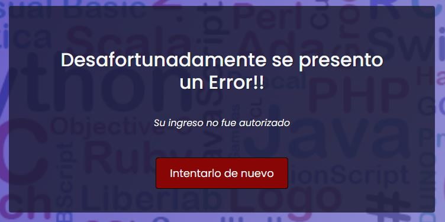

 
 

## Administrator User CRUD Page :construction_worker:

In this space the administrator user will be able to keep track and manage the records stored in the database. When the administrator user logs in correctly, the apprentice section will be the first section to be shown. In this section the user can see all the records registered in the database and there will be some action icons and anchors such as:

- ID number in blue: This is an anchor that will redirect the user to the read section where all the selected apprentice's information will be displayed on but the input fields cannot be modified.
- Update icon in green: This is an anchor that will redirect the user to the update section where all the apprentice's information will be displayed on and most of the input fields can be modified and these changes can saved if the changed values meet the requirements stablished [HERE!!](#usage-hotsprings)
- Delete icon in red: This is an anchor that will redirect the user to a confirmation page that will show important information about the selected apprentice and two buttons one to confirm the deletion of the record and another one to cancel the deletion. After processing the user's choice they will be redirected to the apprenctice section.
 
 
 

### `Apprentice Section` 
 

    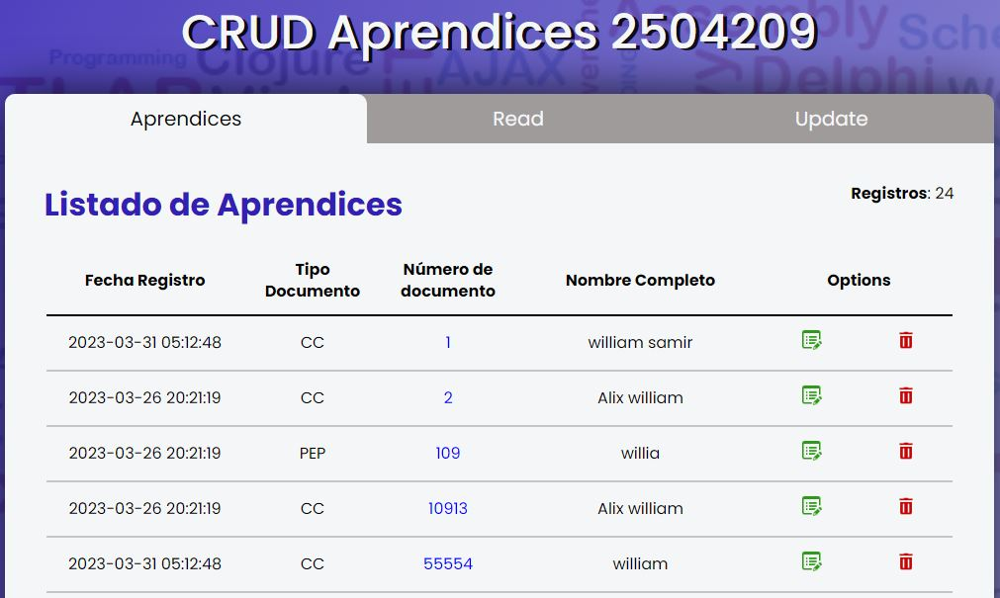

### `Read Section` 
 

This section looks like this because no records have been searched.

    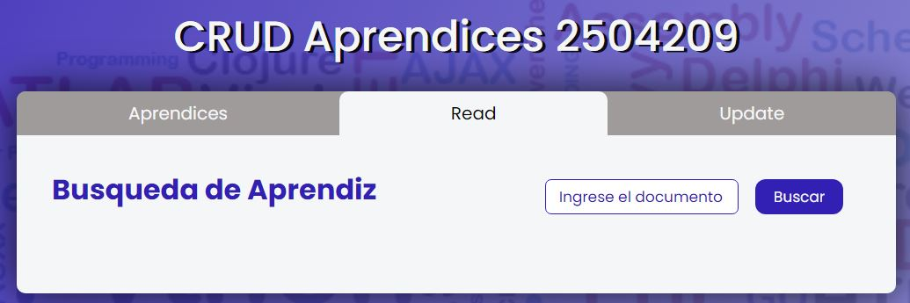

Now, one record has been searched and the information is being displayed on.

    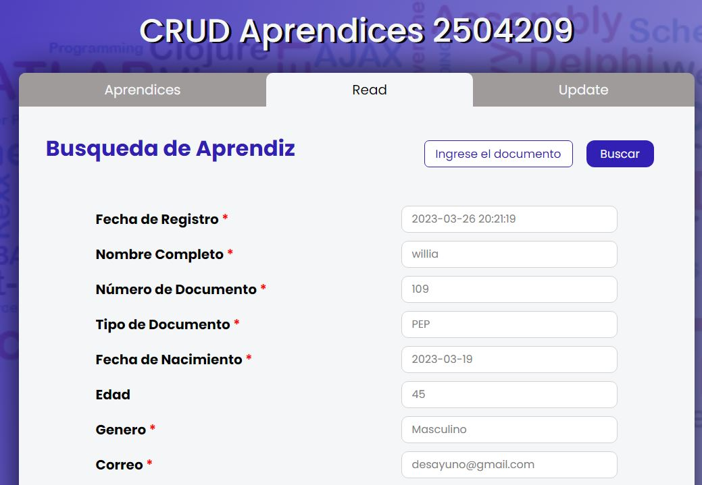

### `Update Section` 
 

This section looks like this because no records have been searched.

    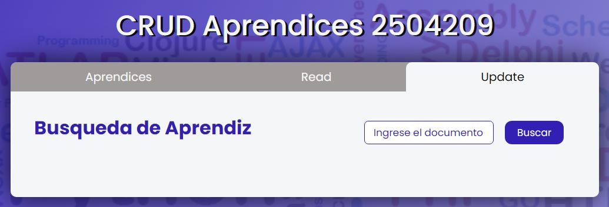

Now, one record has been searched and the information is being displayed on.

    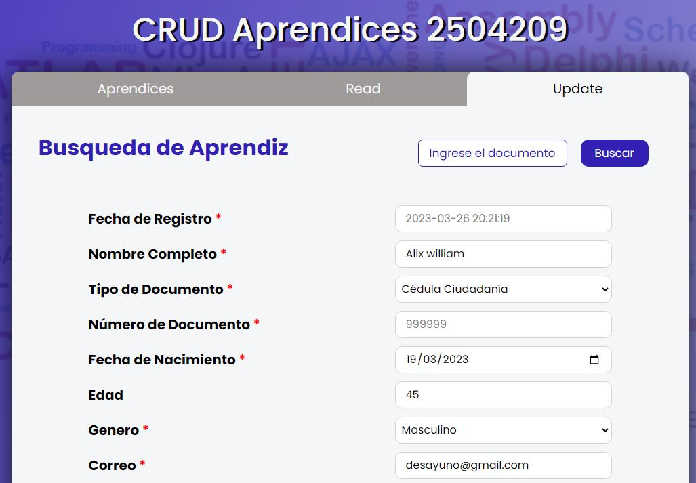

### `Delete Record` 
 

    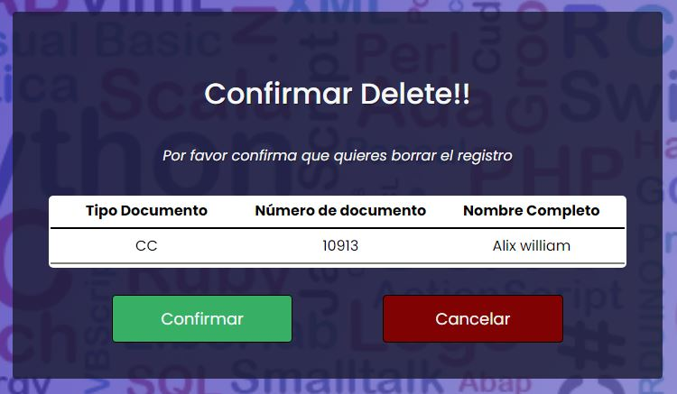

# :computer: Tecnologies

## For Development

- **HTML**: The HyperText Markup Language is the standard markup language for documents designed to be displayed in a web browser.
- **JavaScript**: is a versatile programming language that can be used to develop complex applications. Interpreters for JavaScript are integrated in all modern web browsers, so the language is considerably widespread.
- **CSS**: Cascading Style Sheets is a style sheet language used for describing the presentation of a document written in a markup language such as HTML or XML
- **PHP**: PHP is a general-purpose scripting language geared toward web development.

## For Versioning

- **GIT**: Git is a free and open source distributed version control system designed to handle everything from small to very large projects with speed and efficiency.
- **GitHub**: GitHub is an Internet hosting service for software development and version control using Git.

# :e-mail: Contact

We have a few channels for contact:

* [LinkedIn](https://www.linkedin.com/in/waamirdev-william-pe%C3%B1a/)
* [GitHub Issues](https://github.com/waamir104/ENCRYPTER-Challenge-Oracle-ONE/issues)
* **Email** waamirdev@gmail.com